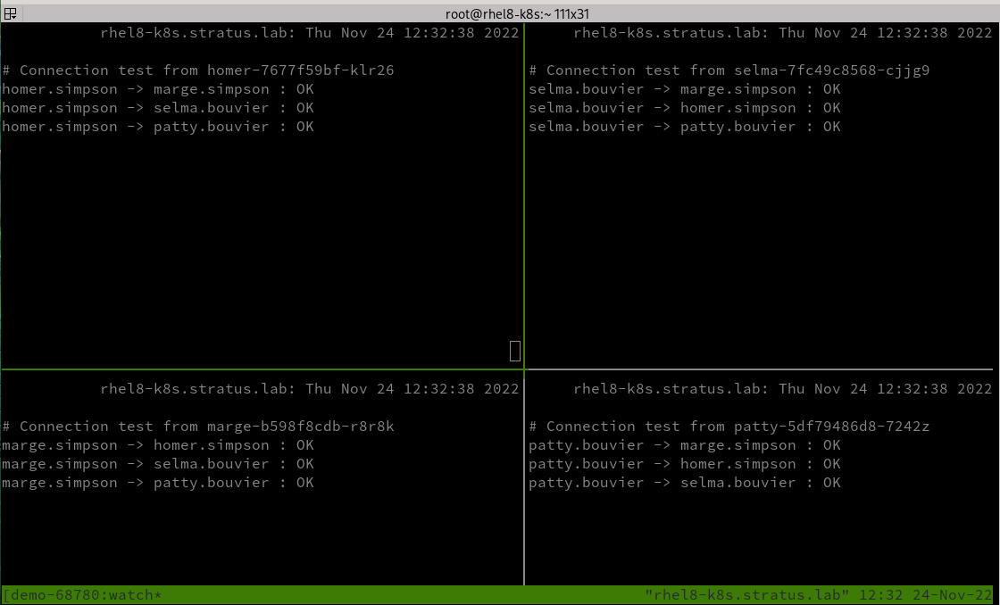
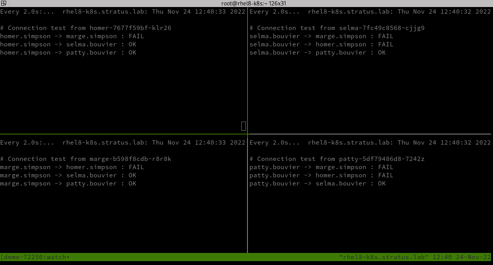
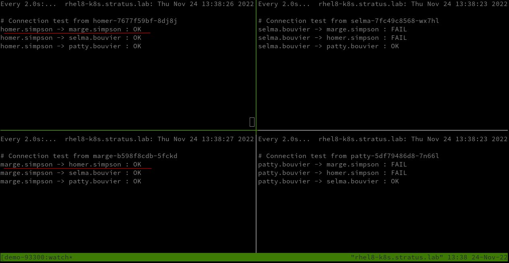
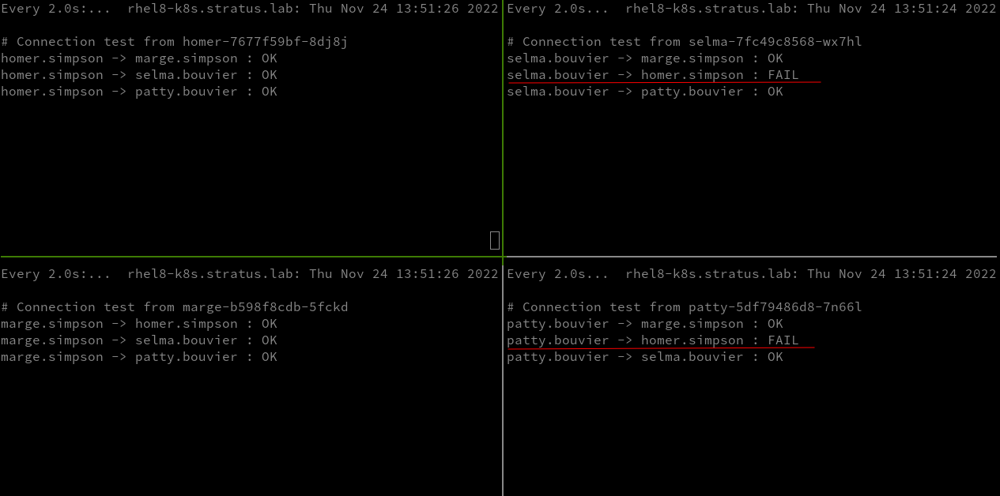

# Introduction

By default kubernetes allows communication between all applications in the cluster regardless of the project they reside in. In a production setup this is not ideal. Fortunately, K8S ships with a facility to help deal with this use case. If you have installed a software defined network provider that respects it, Network Policies are a powerful tool that can help you isolate and direct traffic around in your cluster.

This lab was originally developed by my colleague at Red Hat Robert Bohne. I adapted it for vanilla Kubernetes with the OVN plugin.

> **Note**
> The following is a lab-style document. As such, you should not expect everything to work immediately. There will be some investigation involved.


## App Setup

Robert maintains the containers used throughout this lab. They are fairly simple webservers which attempt to contact each other by referencing each other over their ingress:

```
curl -k https://<ingress url>/demo
```

If there is only a single pod running or connections are failing the output will look similar to the following:

```
curl -k https://patty-bouvier.k3s.lab/demo
# Connection test from patty-5df79486d8-7242z
patty.bouvier -> marge.simpson : FAIL
patty.bouvier -> homer.simpson : FAIL
patty.bouvier -> selma.bouvier : FAIL
```

Unlike in the previous lab (installing the prometheus stack), this lab will not be done with a helm chart. As such it will be up to you to create all of the appropriate resources. The same container image will be used for all 4 characters of the Simpsons demo.

You can find the image stored in a public Quay repository: quay.io/openshift-examples/simple-http-server:micro

At the end of this lab we are trying to accomplish the following:

* All the Bouvier sisters should be able to communicate with each other
* Marge and Homer should be able to communicate
* Homer should be able to yell at Patty and Selma
* Homer will ignore any communication coming from Patty or Selma


### Create the namespace

You will need to create 2 namespaces. One called "bouvier" and the other called "simpson".

<details>
  <summary><b>Hints and Solution</b></summary>
<details>
  <summary><b>HINT: Creating Namespaces</b></summary>
  Kubernetes tends to follow the same pattern for most objects you want to create. In general the syntax is
  
```
kubectl create namespace <name>
```
  </details>
	<details>
    <summary><b>SPOILER: Creating Namespaces</b></summary>
    Simply run the following commands:
    
```
kubectl create namespace bouvier
kubectl create namespace simpson
```
  </details>
  </details>
      </details>

  
### Create the app

  Most of the time when dealing with a production-style setup, administrators will actually create some YAML files that will have all of the objects the application needs to function. In this case you could investigate [how to create a deployment](https://kubernetes.io/docs/concepts/workloads/controllers/deployment/). 
  
  For the purposes of this lab, we don't need to use anything that advanced. Fortunately, as long as you have access to an image, you can create a deployment with the `kubectl` command.
  
Create the following deployments inside the 'bouvier' namespace:
* patty
* selma
  
Create the following deployments inside the 'simpson' namespace:
* homer
* marge

For all four deployments, make sure you tell kubernetes that the container is using **port 8080**.
  
<details>
  <summary><b>Hints and Solution</b></summary>
<details>
  <summary><b>HINT: Creating Deployments</b></summary>
  Try investigating the help for the deployment subcommand:
  
```
kubectl create deployment --help
```
  </details>
	<details>
    <summary><b>SPOILER: Creating Deployments</b></summary>
    Simply run the following commands:
    
```
kubectl create deployment patty --image=quay.io/openshift-examples/simple-http-server:micro --port=8080 -n bouvier
kubectl create deployment selma --image=quay.io/openshift-examples/simple-http-server:micro --port=8080 -n bouvier

kubectl create deployment homer --image=quay.io/openshift-examples/simple-http-server:micro --port=8080 -n simpson
kubectl create deployment marge --image=quay.io/openshift-examples/simple-http-server:micro --port=8080 -n simpson
```
  </details>
  </details>

### Create the service

  After the application is running in the cluster, you need a way to access it. The first step is to ensure that the cluster can access the pod resources. This is done by assigning a private, cluster-scoped IP to each pod as well as a port where the application is listening. The [official documentation](https://kubernetes.io/docs/concepts/services-networking/service/) has a lengthy description on how kubernetes services work. 
  As with deployments, services are most commonly defined in a YAML so that they can be version controlled and distributed more easily. However, for this lab, it is sufficient to create the services on the command line.
  
Create 2 services in the 'bouvier' namespace. For simplicity name the services:
  * patty
  * selma

Repeat the same process for the 'simpson' namespace. Name the services:
  * homer
  * marge

Make sure to expose port 8080. For simplicity sake the port and target port can both be port 8080.
  
  
<details>
  <summary><b>Hints and Solution</b></summary>
<details>
  <summary><b>HINT: Creating Services</b></summary>
  Try investigating the help for the <b>expose deployment</b> subcommand
  
  </details>
	<details>
    <summary><b>SPOILER: Creating Services</b></summary>
    Simply run the following commands:
    
```
kubectl expose deployment patty --type=ClusterIP --port=8080 --target-port=8080 -n bouvier
kubectl expose deployment selma --type=ClusterIP --port=8080 --target-port=8080 -n bouvier
kubectl expose deployment homer --type=ClusterIP --port=8080 --target-port=8080 -n simpson
kubectl expose deployment marge --type=ClusterIP --port=8080 --target-port=8080 -n simpson

```
  </details>
  </details>


### Create an Ingress route

Once a service is created, you need to create a way to access the application from outside the cluster. Create Ingress rules for each of the services you created above. 
  * Ensure that you have the proper annotation so that the HAProxy ingress controller handles the traffic. 
  * Expose the routes over 443 (tls)

<details>
  <summary><b>Hints and Solution</b></summary>
<details>
  <summary><b>HINT 1: Creating Ingress</b></summary>
  Review the ingress creation from the Prometheus/Monitoring Lab
  
  </details>
  <details>
  <summary><b>HINT 2: Creating Ingress</b></summary>
  A sample ingress rule:

```
# Sample
kubectl --namespace <namespace> create ingress <ingress friendly name>\
  --annotation kubernetes.io/ingress.class=haproxy\
  --rule="<route URL>/*=<service name>:8080,tls"
#### End Sample
```    
  </details>
	<details>
    <summary><b>SPOILER: Creating Services</b></summary>
    Simply run the following commands:
    
```
kubectl --namespace bouvier create ingress patty\
  --annotation kubernetes.io/ingress.class=haproxy\
  --rule="patty-bouvier.k3s.lab/*=patty:8080,tls"

kubectl --namespace bouvier create ingress selma\
  --annotation kubernetes.io/ingress.class=haproxy\
  --rule="selma-bouvier.k3s.lab/*=selma:8080,tls"


kubectl --namespace simpson create ingress marge\
  --annotation kubernetes.io/ingress.class=haproxy\
  --rule="marge-simpson.k3s.lab/*=marge:8080,tls"


kubectl --namespace simpson create ingress homer\
  --annotation kubernetes.io/ingress.class=haproxy\
  --rule="homer-simpson.k3s.lab/*=homer:8080,tls"
```
  </details>
    </details>
  
  
### Get The TMUX script and run it in a new shell

Robert has written a handy `tmux` script that should be left running in a seperate terminal. It simply provides a near real-time polling of the 4 pods results. You can get the script via the following:

```
wget https://examples.openshift.pub/networking/network-policy/network-policy-demo/run-tmux.sh
```

You need to know what your wildcard dns entry is to run this script

```
sh run-tmux.sh k3s.lab
```

    
    
## Setup the Network Policy 

    
### Default Deny All    
By default all namespaces can communicate with each other. The first thing we are going to do is use Network Policy to block all traffic destine for the simpson namespace. To do that we are going to a yaml definition and load it with the following contents:
    
```
echo 'kind: NetworkPolicy
apiVersion: networking.k8s.io/v1
metadata:
  name: default-deny
  namespace: simpson
spec:
  podSelector: {}
  policyTypes:
  - Ingress' |kubectl create -f -
```

The results should look something like this:


From the above you can see that all traffic into the namespace is being blocked. Because the script is calling the Ingress route, all connections are being processed by the ingress rule we just created. 

### Allow From Same Namespace
Normally, we want some level of communication from outside the cluster to our application. There might be use cases where the pod communicates only internally, in which case you might adjust your NetworkPolicy to reflect that. In this lab we are interested in hitting a webserver and thus we need outside access. Create the following network policy to allow the `simpson` namespace to communicate with itself:
    
```
echo 'kind: NetworkPolicy
apiVersion: networking.k8s.io/v1
metadata:
  name: allow-same-namespace
  namespace: simpson
spec:
  podSelector: {}
  ingress:
  - from:
    - podSelector: {}
  policyTypes:
  - Ingress' |kubectl create -f -
```

Your tmux session should look something like this now:
    

    
### Allow Bouvier Sisters to Communicate

The last step in order to accomplish our desired setup is to allow the communication between Marge and both of her sisters. For this, you will need to hunt up some information.

We want to make sure that Patty and Selma cannot talk to Homer while at the same ensuring that Marge can talk to whomever she likes. We could make several policies, Marge <--> Patty and then Marge <--> Selma. However, there is an easier way. In this case we can allow an entire namespace to communicate with a specific pod. The simpliest way to accomplish this is to use labels that you either create yourself or already exist. Try and use labels that already exist. Discover labels on the Marge pod and the Bouvier namespace that uniquely identify them and replace the values below:
    
```
apiVersion: networking.k8s.io/v1
kind: NetworkPolicy
metadata:
  name: allow-from-bouviers-to-marge
  namespace: simpson
spec:
  podSelector:
    matchLabels:
      <pod label>
  ingress:
  - from:
    - namespaceSelector:
        matchLabels:
          <namespace label>
  policyTypes:
  - Ingress' 
```    

            
            
<details>
  <summary><b>Hints and Solution</b></summary>
<details>
  <summary><b>HINT: Finding Labels</b></summary>
  Using the <code>kubectl describe</code> command, investigate the pod and the namespace in question and find a suitable label.
  
  </details>
	<details>
    <summary><b>SPOILER: Finding Labels</b></summary>
    To find the labels which already exist on the marge pod use the following command:
    
```
kubectl describe pod marge |grep -i label -A 3
Labels:           app=marge
                  pod-template-hash=b598f8cdb
Annotations:      ovn.kubernetes.io/allocated: true
                  ovn.kubernetes.io/cidr: 10.16.0.0/16
```

Do the same thing for the namespace:

```
kubectl describe namespace bouvier |grep -i label -A 3
Labels:       kubernetes.io/metadata.name=bouvier
Annotations:  ovn.kubernetes.io/cidr: 10.16.0.0/16
              ovn.kubernetes.io/exclude_ips: 10.16.0.1
              ovn.kubernetes.io/logical_switch: ovn-default
```

Finally apply these to the network policy

```
echo 'apiVersion: networking.k8s.io/v1
kind: NetworkPolicy
metadata:
  name: allow-from-bouviers-to-marge
  namespace: simpson
spec:
  podSelector:
    matchLabels:
      app: marge
  ingress:
  - from:
    - namespaceSelector:
        matchLabels:
          kubernetes.io/metadata.name: bouvier
  policyTypes:
  - Ingress' |kubectl create -f -
```
  </details>
  </details>

If you create the policy correctly, you should end up with something like this:

